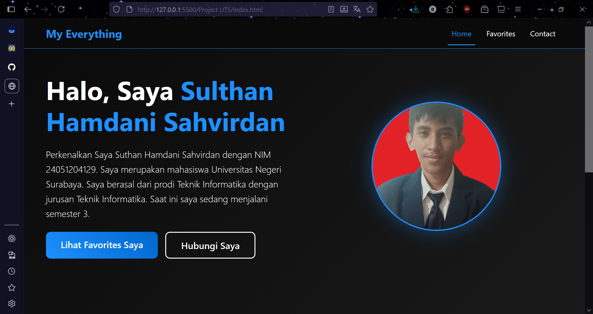

# Project Website UTS PBP Semester 3

## Deskripsi Proyek
Ini adalah website portfolio pribadi yang dibuat menggunakan HTML, CSS, Bootstrap, dan JavaScript dasar. Website terdiri dari 3 halaman: Home (profil), Favorites (hal kesukaan seperti makanan, minuman, film, animasi), dan Contact (form kontak dan link sosial).

## Bahasa yang saya Digunakan
- HTML.
- CSS custom.
- Bootstrap.
- JavaScript.

